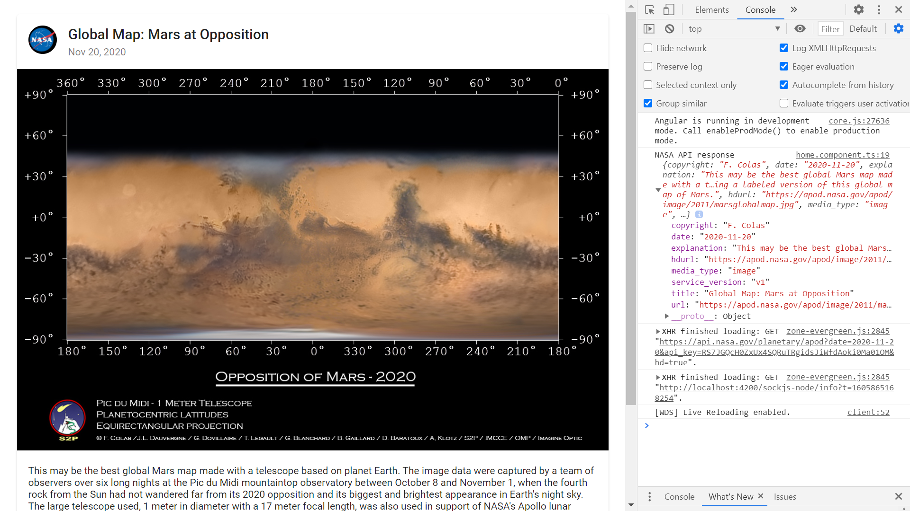

# :zap: Angular NASA API

* App using Angular 12, to view data from the official [NASA API](https://api.nasa.gov/index.html#getting-started).
* Uses Angular Material Card to display image with buttons and credit text below.
* **Note:** to open web links in a new window use: _ctrl+click on link_


## :page_facing_up: Table of contents

* [:zap: Angular NASA API](#zap-angular-nasa-api)
  * [:page_facing_up: Table of contents](#page_facing_up-table-of-contents)
  * [:books: General info](#books-general-info)
  * [:camera: Screenshots](#camera-screenshots)
  * [:signal_strength: Technologies](#signal_strength-technologies)
  * [:floppy_disk: App Setup](#floppy_disk-app-setup)
  * [:computer: Code Examples](#computer-code-examples)
  * [:cool: Features](#cool-features)
  * [:clipboard: Status & To-Do List](#clipboard-status--to-do-list)
  * [:clap: Inspiration](#clap-inspiration)
  * [:file_folder: License](#file_folder-license)
  * [:envelope: Contact](#envelope-contact)

## :books: General info

* NASA card shows Astronomy Picture of the Day (APOD) from the [NASA API](https://api.nasa.gov/). Note video function requires npm module [safe-pipe](https://www.npmjs.com/package/safe-pipe)
* [NASA apod API github repo](https://github.com/nasa/apod-api)
* [http data handling best practices](https://angular.io/guide/http) followed - e.g. use of a separate service file to get API data then use of subscription callback function in component to subscribe to Observable data. Response object type defined using an interface model. Interface passed as type parameter to the HttpClient.get() method. Transformed data passed to async pipe.
* [RxJS take(1)](https://rxjs-dev.firebaseapp.com/api/operators/take)) used instead of map() to emit only the first count value emitted by the source Observable. Then it completes - so no need to unsubscribe to avoid memory leaks.
* This was originally intended to be run on Google Cloud Run in a Docker container but this was not possible with my Windows 10 Home OS, even with a virtual terminal.

## :camera: Screenshots

.
.

## :signal_strength: Technologies

* [Angular v12](https://angular.io/)
* [Angular Material v12](https://material.angular.io/)
* [RxJS Library v6](https://angular.io/guide/rx-library) used to [subscribe](http://reactivex.io/documentation/operators/subscribe.html) to the API data [observable](http://reactivex.io/documentation/observable.html).
* [Mode module @angular/flex-layout](https://www.npmjs.com/package/@angular/flex-layout) provides a layout API using Flexbox CSS + mediaQuery. Still at v11.0.0-beta.33 as of may 2021 [see github repo](https://github.com/angular/flex-layout).

## :floppy_disk: App Setup

* Install dependencies with `npm i`
* Get yourself a [NASA API key](https://api.nasa.gov/index.html#getting-started) from Nasa and add it to your environment config. files
* Run `ng serve` for a dev server and navigate to `http://localhost:4200/`. The app does automatically reload if you change any of the source files

## :computer: Code Examples

* `nasa.service.ts` extract: gets data from Nasa API using APIKEY supplied by them.

```typescript
public getNasaImage(): Observable<Apod> {
  const year = new Date().getFullYear();
  const month = new Date().getMonth() + 1;
  const day = new Date().getDate();
  this.apiKey = environment.NASA_KEY;
  const apodUrl = `https://api.nasa.gov/planetary/apod?date=${year}-${month}-${day}&api_key=${this.apiKey}&hd=true`;
  return this.http.get<Apod>(apodUrl).pipe(
    take(1),
    catchError((err: any) => {
      return throwError("Problem fetching apod from NASA API, error: ", err);
    })
  );
}
```

## :cool: Features

* The NASA API requires a date in the format YYYY-MM-DD. Hence the app `nasa.service` uses the [getFullYear()](https://developer.mozilla.org/en-US/docs/Web/JavaScript/Reference/Global_Objects/Date/getFullYear), [getMonth()](https://developer.mozilla.org/en-US/docs/Web/JavaScript/Reference/Global_Objects/Date/getMonth) and the [getDate()](https://developer.mozilla.org/en-US/docs/Web/JavaScript/Reference/Global_Objects/Date/getDate) methods from the javascript Date.prototype.

## :clipboard: Status & To-Do List

* Status: Working. Note: rxjs v6 used - possible incompatibility issues with latest v7.
* To-Do: Add user date select. Try gcloud Docker - App to be deployed to Google Cloud Run using a Docker image.

## :clap: Inspiration

* [NASA - use of their API](https://api.nasa.gov/)
* [How to run Docker on Windows 10 Home edition](https://www.freecodecamp.org/news/how-to-run-docker-on-windows-10-home-edition/)
* [Docker for windows 10 home](https://www.youtube.com/watch?v=Gtid21ZOqpM)
* [Angular CLI behind the scenes, part one](https://commandlinefanatic.com/cgi-bin/showarticle.cgi?article=art074)
* [Angular CLI Behind the Scenes, Part two](https://commandlinefanatic.com/cgi-bin/showarticle.cgi?article=art075)

## :file_folder: License

* This project is licensed under the terms of the MIT license.

## :envelope: Contact

* Repo created by [ABateman](https://github.com/AndrewJBateman), email: gomezbateman@yahoo.com
